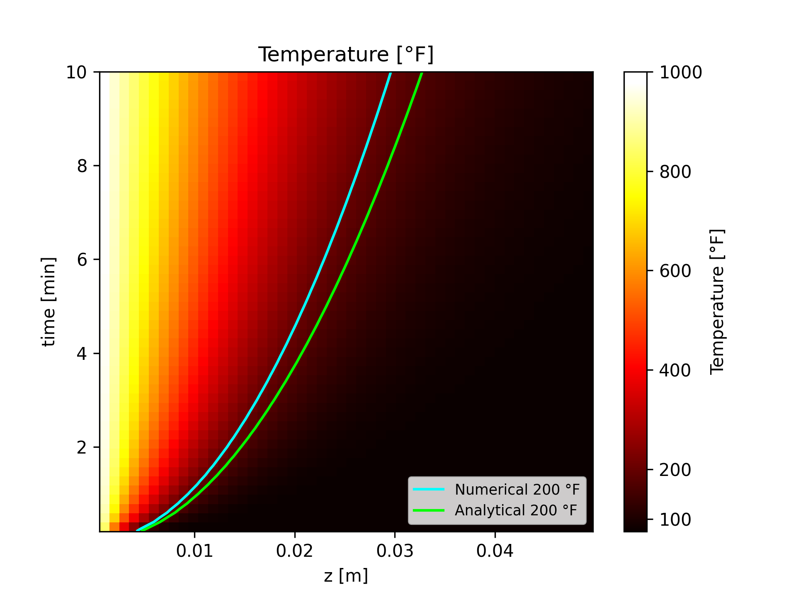

# Heat conduction between two blocks in 1D

- Start the project by sourcing `source bootstrap.sh` in the terminal.

- Run the case with `./Allrun`, this will handle the whole workflow.

- Once finished, run `python3 model.py` for post-processing of the results.

---

